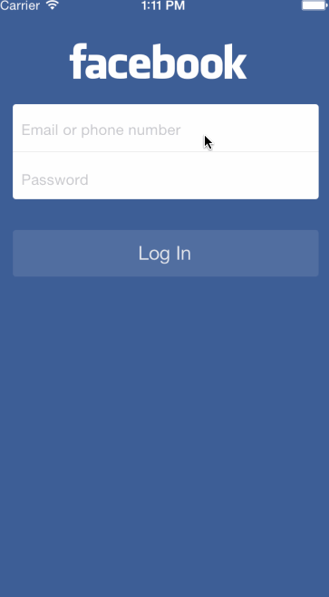

# Facebook
Facebook protoype app
This is a sample prototype app built as part of iOS training class. It does the following:

* Provides a login screen
* Checks for login and password correctness (hardcoded values)
* Enables user to refresh the news feed (same content as the previous feed, no new stories)
* Does a signout flow with a confirmation sheet
* 

GIF created with [LiceCap](http://www.cockos.com/licecap/).
